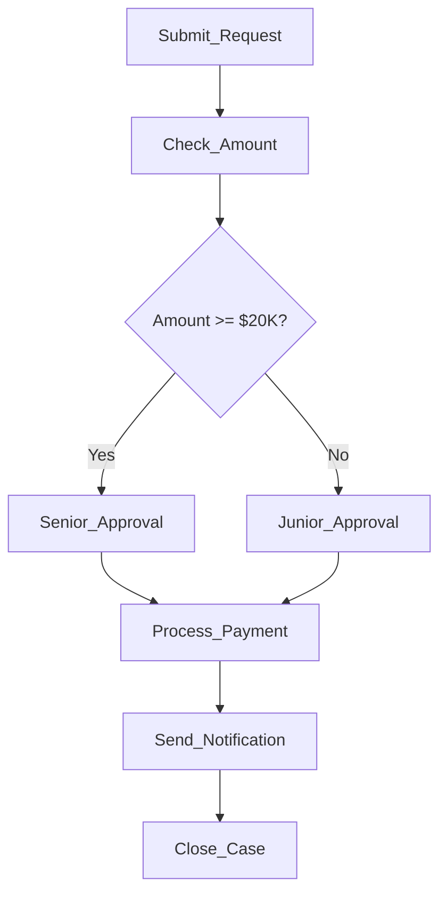

# Business Process Model & File Locations

## Business Process Model

### Purchase Approval Process (Simplified)

The synthetic evaluation uses a **purchase approval workflow** with 7 activities:



### Activity Details

| Activity | Description | Resources | Timing |
|----------|-------------|-----------|--------|
| **Submit_Request** | Employee submits purchase request | Clerk_1-5 | Start |
| **Check_Amount** | System/clerk checks purchase amount | Clerk_1-5 | +5-30 min |
| **Junior_Approval** | Junior manager approves (< $20K) | Junior_1-3 | +10-60 min |
| **Senior_Approval** | Senior manager approves (≥ $20K) | Senior_1-2 | +1-12 hours |
| **Process_Payment** | Payment processed | Processor_1-3 | +1-12 hours |
| **Send_Notification** | Requestor notified | System | +1-24 hours |
| **Close_Case** | Case closed | System | +5-30 min |

### Case Attributes

- **case_id**: Unique identifier (Case_1, Case_2, ...)
- **amount**: Purchase amount (log-normal distribution, mean ~$15K)
- **timestamp**: Event timestamps (realistic delays between activities)
- **resource**: Person/system performing activity
- **role**: "senior" or "junior" for approval events

### Distribution

- **Total cases**: 1,000
- **Amount distribution**: Log-normal (mean $15K, σ=0.8)
- **Cases requiring senior approval** (≥ $20K): ~32.5% (325 cases)
- **Time range**: Jan 1 - Jun 30, 2024

---

## Policy Under Test

### P1: Senior Approval Duty

**Rule**: Purchases ≥ $20,000 require senior approval within 24 hours of submission.

**Formal Definition**:
```
IF amount >= $20,000 THEN
  MUST HAVE Senior_Approval
  WITHIN 24 hours of Submit_Request
  OR Junior_Approval WITHIN 24 hours (delegation allowed)
```

**Parameters**:
- **Threshold (T)**: $20,000
- **Delegation Window (Δ)**: 24 hours
- **Allowed delegation**: Yes (junior can approve if within window)

**Violation Types**:
1. **Missing approval**: No approval event at all
2. **Late approval**: Approval > 24h after submission
3. **Wrong role (late)**: Junior approval when senior required, outside window

---

## File Locations

### Generated Event Logs

**Primary location**: `eval/synthetic/outputs/<run_id>/`

**Example run**: `eval/synthetic/outputs/20260118_040913/`

```
eval/synthetic/outputs/20260118_040913/
├── event_log.xes                  # XES format (PM4Py standard)
├── event_log.csv                  # CSV format (human-readable)
├── ground_truth.csv               # Case-level labels
├── predictions.csv                # Policy checker results
├── pr_curve.csv                   # Precision-recall curve
├── metrics.json                   # Performance metrics
├── baseline_results.csv           # Control-flow vs policy comparison
├── sweep_results_fixed.csv        # Parameter sweep results
└── ...
```

### Event Log Formats

#### 1. XES Format (event_log.xes)
Standard process mining format, readable by ProM, Disco, PM4Py:
```bash
eval/synthetic/outputs/20260118_040913/event_log.xes
```

#### 2. CSV Format (event_log.csv)
Human-readable tabular format:
```bash
eval/synthetic/outputs/20260118_040913/event_log.csv
```

**Schema**:
```
case_id,activity,timestamp,resource,role,amount
Case_1,Submit_Request,2024-02-11 11:00:00,Clerk_3,,6587.12
Case_1,Check_Amount,2024-02-11 11:22:00,Clerk_1,,6587.12
Case_1,Junior_Approval,2024-02-11 11:57:00,Junior_2,junior,6587.12
Case_1,Process_Payment,2024-02-11 15:57:00,Processor_1,,6587.12
Case_1,Send_Notification,2024-02-12 15:57:00,System,,6587.12
Case_1,Close_Case,2024-02-12 16:10:00,System,,6587.12
```

### Ground Truth Labels

**Location**: `eval/synthetic/outputs/<run_id>/ground_truth.csv`

**Example**: `eval/synthetic/outputs/20260118_040913/ground_truth.csv`

**Schema**:
```
case_id,amount,requires_senior,outcome,is_violation
Case_1,6587.12,False,not_applicable,False
Case_4,46412.71,True,duty_unmet,True
```

**Outcome values**:
- `not_applicable`: Amount < $20K (policy doesn't apply)
- `duty_met`: Senior approval within window
- `duty_met_via_delegation`: Junior approval within window (allowed)
- `duty_unmet`: Violation (missing/late/wrong approval)

### Policy Checker Predictions

**Location**: `eval/synthetic/outputs/<run_id>/predictions.csv`

**Example**: `eval/synthetic/outputs/20260118_040913/predictions.csv`

**Schema**:
```
case_id,amount,requires_senior,outcome,is_violation,severity,lateness_hours,role_category,evidence
Case_1,6587.12,False,not_applicable,False,0.0,0.0,not_applicable,not_applicable, lateness=0.0h
Case_4,46412.71,True,duty_unmet,True,0.6,96.5,senior_late,senior_late, lateness=96.5h
```

**Key columns**:
- `severity`: Continuous score [0, 1] indicating violation severity
- `lateness_hours`: Hours past delegation window (0 if on time)
- `role_category`: Classification of approval type
- `evidence`: Human-readable explanation

---

## Multi-Seed Runs

**Location**: `eval/synthetic/outputs/multiseed/`

For robustness evaluation, we ran 10 seeds (42-51):

```
eval/synthetic/outputs/
├── 20260118_040842/    # Seed 42
├── 20260118_040847/    # Seed 43
├── 20260118_040850/    # Seed 44
├── ...
├── 20260118_040913/    # Seed 51
└── multiseed/
    ├── seeds_summary.csv    # Mean/std across all seeds
    └── seeds_details.csv    # Per-seed results
```

---

## Paper-Ready Package

**Location**: `eval/synthetic/paper_ready/<run_id>_v2/`

**Example**: `eval/synthetic/paper_ready/20260118_040913_v2/`

Contains curated results for paper submission:

```
eval/synthetic/paper_ready/20260118_040913_v2/
├── table_main.csv              # Main results table
├── table_main.tex              # LaTeX format
├── table_seeds.csv             # Multi-seed summary
├── table_seeds.tex             # LaTeX format
├── pr_curve.csv                # PR curve data
├── pr_curve.png                # PR curve plot
├── severity_hist.png           # Severity distribution
├── calibration_curve.png       # Calibration plot
├── metrics_overview.md         # 2-page summary
├── baseline_details.txt        # Baseline method documentation
├── run_repro.txt               # Reproduction commands
└── CHANGES_V2.md               # Version history
```

---

## Accessing the Files

### Quick Access Commands

```bash
# View event log (CSV)
cat eval/synthetic/outputs/20260118_040913/event_log.csv | head -20

# View ground truth
cat eval/synthetic/outputs/20260118_040913/ground_truth.csv | head -20

# View predictions
cat eval/synthetic/outputs/20260118_040913/predictions.csv | head -20

# Load in Python
import pandas as pd
log = pd.read_csv('eval/synthetic/outputs/20260118_040913/event_log.csv')
gt = pd.read_csv('eval/synthetic/outputs/20260118_040913/ground_truth.csv')
pred = pd.read_csv('eval/synthetic/outputs/20260118_040913/predictions.csv')

# Load XES in PM4Py
from pm4py.objects.log.importer.xes import importer as xes_importer
log = xes_importer.apply('eval/synthetic/outputs/20260118_040913/event_log.xes')
```

### Available Runs

List all runs:
```bash
ls -la eval/synthetic/outputs/
```

Latest run:
```bash
ls -t eval/synthetic/outputs/ | grep -v multiseed | head -1
```

---

## Process Model Source Code

**Generation**: [eval/synthetic/cp1_generate_clean_log.py](eval/synthetic/cp1_generate_clean_log.py)

Key function:
```python
def generate_simple_process_log(config: SyntheticConfig) -> EventLog:
    """
    Generate synthetic purchase approval event log.

    Process: Submit → Check → Approval → Process → Notify → Close
    """
```

**Violation Injection**: [eval/synthetic/cp2_inject_violations_noisy.py](eval/synthetic/cp2_inject_violations_noisy.py)

Key function:
```python
def inject_violations(log: EventLog) -> Tuple[EventLog, pd.DataFrame]:
    """
    Inject policy violations:
    - Remove approval events
    - Delay approvals beyond window
    - Replace senior with junior approval

    Plus noise scenarios:
    - Near-miss (boundary ±5min)
    - Multiple approvals
    - Missing roles
    - Timestamp jitter
    - Out-of-order events
    """
```

**Policy Checker**: [eval/synthetic/cp3_enhanced_policy_checker.py](eval/synthetic/cp3_enhanced_policy_checker.py)

Key function:
```python
def compute_severity_score(case_id, amount, request_ts, approvals, T, delta_hours):
    """
    Check P1 (Senior Approval Duty) and compute severity.

    Returns:
    - outcome: duty_met / duty_met_via_delegation / duty_unmet
    - is_violation: boolean
    - severity: continuous [0, 1]
    """
```

---

## Policy Log (ODRL)

**Note**: This evaluation does NOT use external policy files. The policy is **hard-coded** in the checker for simplicity.

If you want to create an ODRL policy file for documentation:

**Location** (example): `eval/synthetic/policies/p1_senior_approval.odrl`

```json
{
  "@context": "http://www.w3.org/ns/odrl.jsonld",
  "@type": "Policy",
  "uid": "http://example.com/policy/P1",
  "profile": "http://example.com/odrl:profile:BusinessProcessCompliance",
  "permission": [
    {
      "target": "http://example.com/activity/ProcessPayment",
      "action": "execute",
      "constraint": [
        {
          "leftOperand": "http://example.com/attribute/amount",
          "operator": "gteq",
          "rightOperand": 20000,
          "constraint": [
            {
              "leftOperand": "http://example.com/activity/SeniorApproval",
              "operator": "temporal:before",
              "rightOperand": {
                "event": "http://example.com/activity/SubmitRequest",
                "delay": "P1D"
              }
            }
          ]
        }
      ]
    }
  ]
}
```

**Currently**: Policy is implemented directly in Python (see `cp3_enhanced_policy_checker.py::compute_severity_score()`).

**Future work**: Could parse external ODRL files, but not implemented for this evaluation.

---

## Summary

| What | Where |
|------|-------|
| **Event logs (XES)** | `eval/synthetic/outputs/<run_id>/event_log.xes` |
| **Event logs (CSV)** | `eval/synthetic/outputs/<run_id>/event_log.csv` |
| **Ground truth** | `eval/synthetic/outputs/<run_id>/ground_truth.csv` |
| **Predictions** | `eval/synthetic/outputs/<run_id>/predictions.csv` |
| **Paper package** | `eval/synthetic/paper_ready/<run_id>_v2/` |
| **Process model code** | `eval/synthetic/cp1_generate_clean_log.py` |
| **Policy checker code** | `eval/synthetic/cp3_enhanced_policy_checker.py` |
| **Policy (hard-coded)** | In `cp3_enhanced_policy_checker.py::compute_severity_score()` |

**Latest run**: `20260118_040913`
**Paper-ready**: `eval/synthetic/paper_ready/20260118_040913_v2/`

---

*Generated: 2026-01-18*
